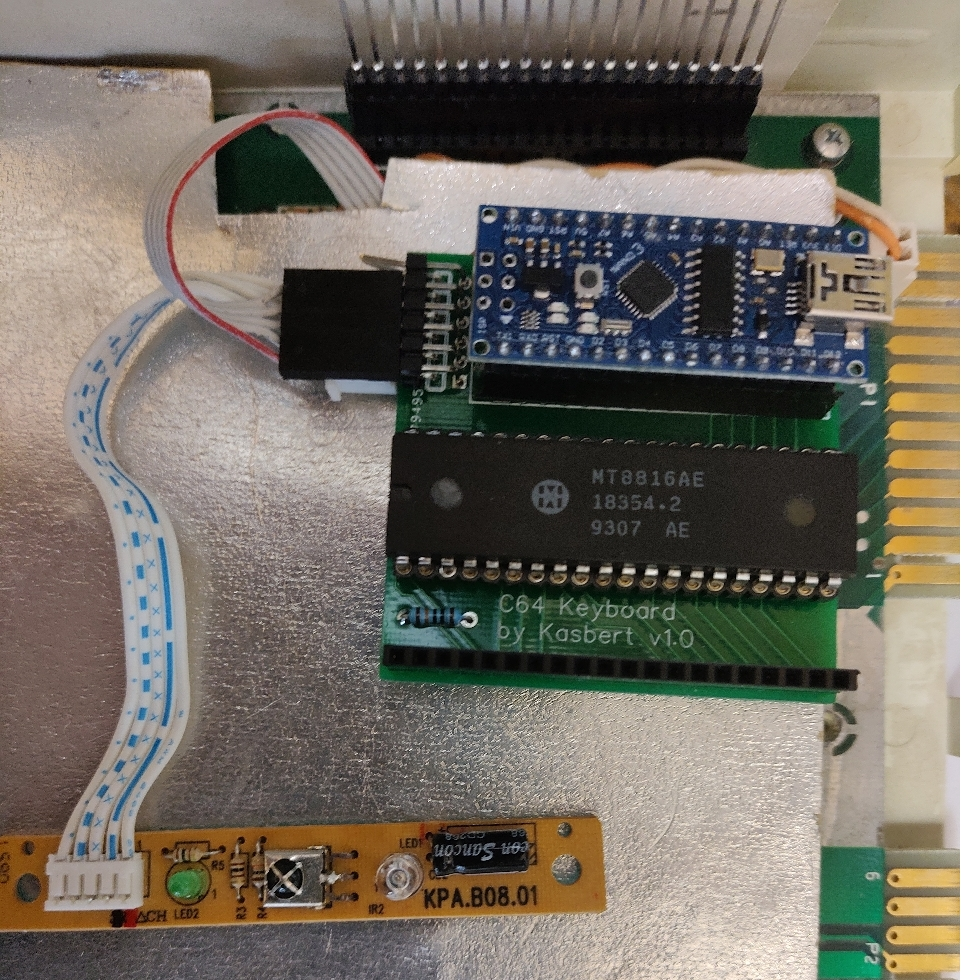
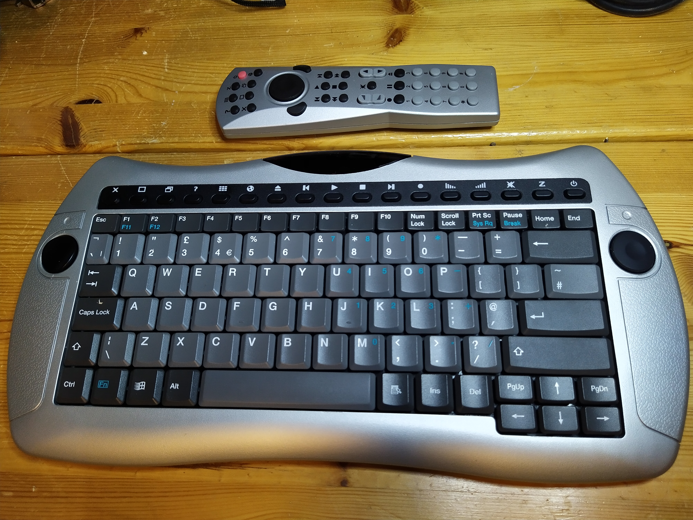
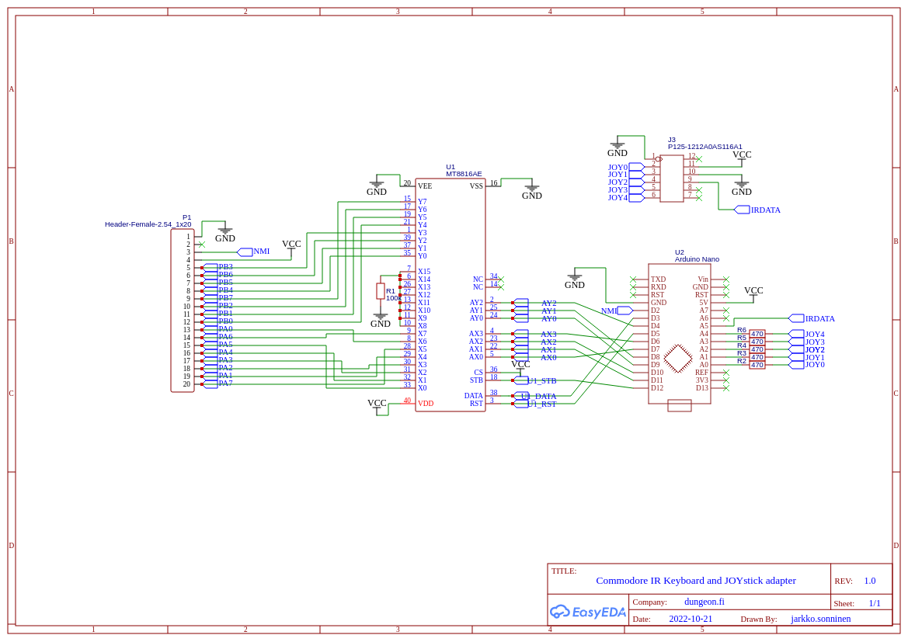
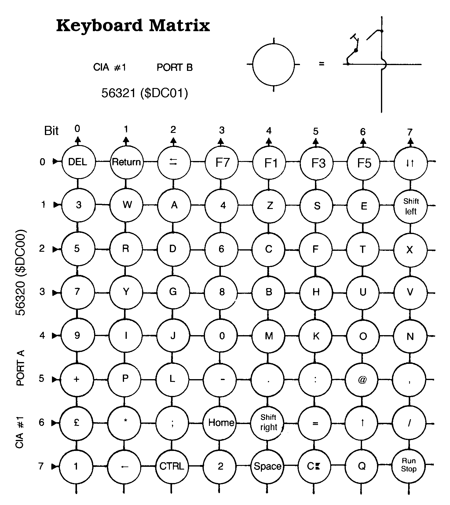

### Commodore InfraRed Keyboard and JOYstick

You've always wanted to use your Commodore 64 or VIC-20 with an infrared remote control and wireless keyboard!!

The device is connected to Commodore internal keyboard connector and optionally to joystick pins.
Uses mysterious infrared keyboard and remote labeled as FDC-3412

The device emulates the keyboard matrix with [MT8816](doc/MT8816AE.pdf) Analog Switch Array.
The switch array is controlled by a Arduino Nano. Infrared receiver is connected to one Arduino pin.
5 other Arduino pins are connected to Commodore main board joystick pins. Only 1 joystick is supported.
Current version uses direct connection to the joystick pins and does not take advantage of the keyboard connector.

Here's the schematics

Info aout the infrared keyboard and remote: https://github.com/kasbert/IR-Keyboard

Keyboard matrix code is originally from https://github.com/Hartland/C64-Keyboard,
which I have modified in https://github.com/kasbert/C64-Keyboard

Keycodes are based on this matrix (see c64key.h):
 
